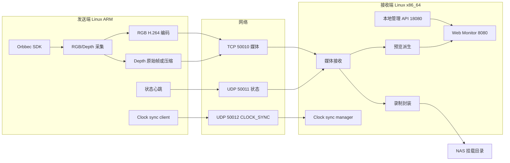

# 系统架构与技术路线

更新时间：2026-07-07

本文档说明系统架构、当前技术路线、为什么这么选，以及哪些方向只是后续候选。

## 1. 当前实现总览

当前主线采用：

1. Linux 发送端 + Linux 接收端。
2. C++ 核心数据面。
3. Orbbec C/C++ SDK 采集。
4. RGB 使用 H.264 编码。
5. Depth 以原始 `uint16` 深度帧为母版，传输可使用原始帧、zlib 无损或配置的量化/分块压缩。
6. 媒体数据走 TCP。
7. 状态心跳走 UDP。
8. CLOCK_SYNC 走独立 UDP 端口，接收端作为时间基准。
9. 接收端提供本地 HTTP 管理 API。
10. Web Monitor 使用 FastAPI 做网页和 REST 代理。
11. 录制数据写入 NAS 挂载目录。

## 2. 为什么从旧方案切到当前方案

旧资料里出现过 Windows 接收端、Python SDK 输出、RTP/UDP 链路等方案。当前主线不继续使用这些作为正式路径，主要原因是：

1. 多路 RGBD 数据吞吐较高，核心链路需要更可控的性能和资源占用。
2. 接收端需要长期运行、集中管理、写 NAS，Linux 服务化更合适。
3. Python SDK 实时取流不适合作为正式数据交付边界，录制文件更稳定、更容易复查。
4. 多发送端需要统一身份、统一状态和统一录制控制，不能依赖临时脚本散装管理。
5. 现场问题表明，预览链路、录制链路和下游同步必须明确拆开。

## 3. 技术选择原因

### 3.1 为什么核心链路用 C++

当前实现选择 C++ 做发送端和接收端核心，是为了：

1. 降低高帧率、多路数据传输时的运行开销。
2. 方便直接调用 Orbbec SDK、GStreamer、ffmpeg 和系统网络接口。
3. 让媒体包、时间戳、队列、线程和写盘行为更可控。
4. 减少解释器运行时对稳定性的影响。

Python 仍然用于工具脚本、导出脚本和 Web Monitor 代理层，但不作为核心媒体数据面。

### 3.2 为什么发送端用 Orbbec SDK

Orbbec Gemini 相机的 RGB、Depth、时间戳、Depth scale、相机参数和对齐能力都来自 SDK。发送端通过 SDK 获取这些底层数据，再把它们转换成本项目的统一协议。

当前要求是 SDK 调用集中在相机适配层，不应散落到业务逻辑各处。

### 3.3 为什么 RGB 用 H.264

RGB 原始数据量很大，直接无线传输成本过高。H.264 的优势是：

1. 压缩率高，网络压力低。
2. 硬件编码支持较普遍，适合 ARM 板卡。
3. 接收端和下游工具都容易处理。
4. 可以封装为 MP4，便于查看和交付。

H.265 可以作为后续候选，但当前默认不启用。

### 3.4 为什么 Depth 以无损为母版

Depth 是测量数据，不只是给人看的画面。伪彩 Depth 只能用于预览，不能作为正式母版。

当前原则：

1. 正式 Depth 母版是 `uint16` 深度值。
2. 传输可以使用 zlib 这类无损压缩，也可以在配置明确误差边界时使用量化/分块压缩。
3. 落盘和导出必须保留 `depth_scale`、相机参数和时间戳。
4. 量化压缩只改变深度数值精度，不改变 RGBD 像素对应关系；下游仍必须读取 `calibration.json` 和 `frames.csv`。

### 3.5 为什么媒体走 TCP

当前媒体通道使用 TCP 50010。

优点：

1. 实现简单。
2. 顺序和可靠性交给 TCP。
3. 接收端更容易按包处理和落盘。
4. 当前代码已经围绕 TCP 媒体通道实现。

代价：

1. 网络拥塞时会产生回压。
2. 某一路发送慢可能拖累发送端队列。
3. 多发送端满负载时需要更仔细地做码率、队列和预览降级。

所以后续路线里会评估 SRT、RTP/UDP、多通道拆分、预览和录制分离等方向，但当前不能把它们写成已实现。

### 3.6 为什么状态走 UDP

状态心跳用 UDP 50011，是因为状态包小、频繁、允许短暂丢失。状态包丢一个不应阻塞媒体发送。

状态用于：

1. 发现发送端和相机在线。
2. 更新帧率、码率、丢帧、延迟等指标。
3. 上报相机离线、编码器失败、重连等事件。

### 3.7 为什么增加 CLOCK_SYNC

CLOCK_SYNC 用独立 UDP 50012 做轻量四时间戳测量，目标是 dataset-grade 统一时间轴，不是硬件同步。

当前原则：

1. receiver 是 master clock。
2. sender 周期性 probe receiver，sender 根据 t1/t2/t3/t4 估计 `offset_us`、`delay_us` 和 `drift_ppm`。
3. sender 通过状态上报 offset，receiver 为媒体包生成 `global_timestamp_us`。
4. CLOCK_SYNC 不阻塞采集、编码、媒体发送或录制。
5. 没有有效模型时系统降级运行，`global_timestamp_us` 退回原始 sender 时间戳。

### 3.8 为什么本地录制后再发布到 NAS

正式输出是录制文件，而不是实时 SDK 输出。NAS 作为最终交付目录的好处是：

1. 录制完成后文件可复查。
2. 多路数据按目录组织，便于交付。
3. 下游处理可以离线读取，不要求实时连接接收端。
4. 接收端统一控制写盘，发送端不需要知道 NAS。

NAS 可以通过 NFS、CIFS/SMB 或等价网络文件系统挂载。实时媒体不再直接写网络挂载：receiver 先写本地 staging；独立上传器把已关闭的 fragmented MP4、Depth、CSV 和元数据可靠复制到 NAS 隐藏 capture queue，确认文件清单和持久化后，再以发布日志和最后一步 `recording_ready.json` 原子交付最终目录。生产配置直接交付带 `moov+moof+mfra` 的完整 fMP4，不再为了普通 MP4 兼容性完整读回并重写 RGB 文件；旧播放器兼容模式仍可按配置启用。

### 3.9 为什么 Web Monitor 不直接做数据面

Web Monitor 只负责展示和控制，不负责决定底层数据语义。

这样做的原因是：

1. 网页适合看状态和预览，不适合作为正式录制数据来源。
2. 接收端 C++ 服务才是权威状态和录制控制入口。
3. UI 改版不应影响 `frames.csv`、协议字段和落盘格式。

## 4. 当前模块边界

| 模块 | 职责 | 不负责 |
| --- | --- | --- |
| `01_sender_linux` | 采集、编码、Depth 压缩、媒体发送、状态上报、CLOCK_SYNC 客户端、本地预览 | NAS 写入、录制控制、Web 页面 |
| `02_receiver_linux` | 媒体接收、状态聚合、CLOCK_SYNC 模型、录制控制、预览派生、本地 staging、管理 API | 修改发送端采集参数、分配正式 ID |
| `03_common_core` | 协议常量、媒体包头、公共结构 | 业务流程 |
| `05_tools` | 启停、状态、预检、导出、时间同步、NAS 可靠上传和维护脚本 | 核心媒体采集与编码 |
| `06_configs` | 发送端和接收端配置模板 | 现场密码和私有凭据 |
| `09_web_monitor` | 网页和 REST 代理 | 底层数据语义 |

## 5. 当前已知限制

1. TCP 媒体链路在多路高码率时可能回压。
2. 严格画面内容级跨相机同步尚未实现，当前依赖系统时间、CLOCK_SYNC 和离线对齐。
3. Web 预览是监控用途，不是正式数据源。
4. Depth 高规格会明显增加 USB、CPU、网络和接收端压力。
5. 本地 staging 容量有上限；NAS 长时间不可用时会在达到保留水位后停止录制。
6. 现场配置和仓库模板可能不同，正式文档以主线能力为准，现场状态只作为部署信息。

## 6. 后续候选路线

候选路线必须经过测试后才能进入当前实现：

1. 预览链路和录制链路进一步分离。
2. RGB 和 Depth 分通道传输。
3. 发送端多队列、多连接或更强背压隔离。
4. SRT、RTP/UDP 或 WebRTC 等替代传输协议。
5. 更强的接收端多实例分片能力。
6. PTP 或硬件同步。
7. 长时间稳定性测试和自动验收。

这些路线的详细优先级见 [07_后续发展路线.md](07_后续发展路线.md)。
