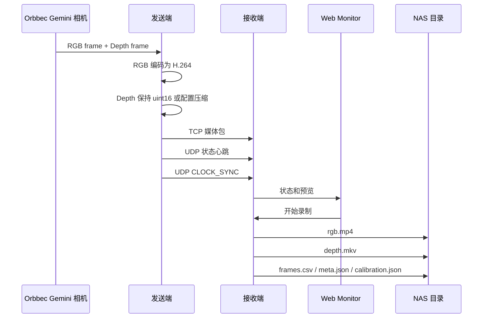

# RGBD 数据链路

更新时间：2026-07-07

本文档说明 RGB 和 Depth 数据从相机到录制文件的完整链路，并解释时间戳、帧号、预览和下游同步的关系。

## 1. 总体链路



## 2. 身份链路

每个媒体包都带两个身份字段：

1. `sender_id`
2. `camera_id`

接收端组合出：

```text
camera_key = <sender_id>_<camera_id>
```

`camera_key` 是系统内部最重要的定位方式。相机显示名称、存储别名和文件名前缀只能改变展示和文件命名，不能改变原始身份。

## 3. RGB 链路

当前 RGB 链路如下：

```text
Orbbec RGB frame
  -> 发送端获取 RGB 帧号和时间戳
  -> H.264 编码
  -> TCP 媒体包 stream_type=rgb
  -> 接收端录制阶段写入 fragmented rgb.mp4
  -> 正常停止后无损重封装并原子发布普通 rgb.mp4
  -> 接收端在 frames.csv 中记录对应关系
```

当前设计要点：

1. RGB 正式录制文件是 `rgb.mp4`。
2. 录制阶段使用 fragmented MP4，降低异常中断时缺 `moov` 导致整段不可读的风险；正常停止后转换为普通 MP4，兼容 Windows 等播放器的进度条拖动。
3. RGB 视频帧和 `frames.csv` 行之间不能靠“第 N 行等于第 N 帧”这种隐含假设。
4. 当前正式做法是在 `frames.csv` 中写 `rgb_recorded` 和 `rgb_video_frame_index`。
5. 下游读取 `rgb.mp4` 时，应通过 `rgb_video_frame_index` 找到对应的视频帧。

## 4. Depth 链路

当前 Depth 链路如下：

```text
Orbbec Depth frame
  -> 发送端获取 uint16 depth_raw
  -> 可选 none / zlib / qdelta / pq12zlib / q8lz4 / pq8zlib / pq8lz4
  -> TCP 媒体包 stream_type=depth_raw
  -> 接收端解压并按 uint16 little-endian 解析
  -> 接收端写入 depth.mkv + FFV1
  -> 接收端在 frames.csv 中记录对应关系
```

当前设计要点：

1. Depth 母版是原始 `uint16` 深度值。
2. 伪彩 Depth 只用于预览，不是正式数据。
3. `depth_scale` 必须保留，用于把原始深度值换算为真实距离。
4. `y11` / `y12` 是设备输出格式档位；发送端经 SDK 获取后，对外统一按 `uint16 depth frame` 发送。
5. 默认倾向使用 `y12`，因为它比 `y11` 多 1 bit 深度量化信息。
6. 量化类压缩需要读取 `codec_or_compression` 和 `quantization_step_mm` 的实际配置；它降低深度数值精度，不改变像素坐标关系。

## 5. 预览链路

预览不是正式数据源。

当前有两类预览：

1. 发送端本地预览：用于现场看相机画面和粗略状态。
2. 接收端 Web 预览：用于远程监控在线相机、RGB 画面和 Depth 伪彩。

Web 预览依赖接收端从媒体数据派生出的图片或低码率预览流。预览卡顿、颜色变化或刷新慢，不等于正式录制文件一定损坏；必须结合 `frames.csv`、`meta.json`、日志和录制文件一起判断。

## 6. 时间戳链路

每路数据至少要区分三类时间：

| 字段 | 含义 | 用途 |
| --- | --- | --- |
| `timestamp_us` | 设备或 SDK 帧时间戳 | 保留相机侧原始时间语义 |
| `system_timestamp_us` | 发送端主机系统时间戳，Unix epoch microseconds | 单发送端诊断和无 clock model 时的对齐依据 |
| `global_timestamp_us` | 接收端按 sender 的 CLOCK_SYNC offset 换算后的统一时间戳 | 多发送端离线对齐的优先字段 |
| 接收端本地时间 | 接收端收到包或写盘时的时间 | 诊断网络、队列和接收端压力 |

时间显示和时间戳字段要分开：

1. 桌面和 Web Monitor 的可读时间按北京时间 UTC+8 显示到秒。
2. 协议、API、CSV 和落盘字段中的 `*_timestamp_us` 保持 Unix epoch microseconds。
3. 对齐和下游处理使用原始微秒时间戳，不使用页面显示字符串。
4. 多发送端数据集优先使用 `global_timestamp_us`，并保留 `frame_system_timestamp_us` 用于回退和排查。

## 7. RGB 和 Depth 配对

RGB 与 Depth 不能简单假设同一个序号就是同一时刻。

当前原则：

1. RGB 和 Depth 保留各自独立的帧号。
2. RGB 和 Depth 保留各自独立的时间戳。
3. 接收端记录足够字段，供后续离线按时间戳匹配。
4. pair 级结果不能覆盖原始单流字段。

旧版文档中的 strict / realtime 配对语义保留为下游处理思路：

1. strict：只有时间差小于阈值时才认为成对。
2. realtime：实时优先，可取最近帧，但必须暴露 `pair_delta_ms` 和完整性。

当前主线负责记录字段，不承诺已经完成严格同步算法。

## 8. 落盘目录

接收端每段录制通常写入：

```text
<nas_root>/<storage_key>/<YYYY-MM-DD>/<HHMMSS>/
```

默认 `storage_key` 是：

```text
<sender_id>_<camera_id>
```

如果设置了相机自命名，存储目录可能使用自命名。原始 `sender_id` / `camera_id` 仍会写在 `meta.json` 和 `calibration.json` 中。

## 9. 主要落盘文件

| 文件 | 当前作用 |
| --- | --- |
| `rgb.mp4` | RGB 正式视频文件，H.264；录制中为 fragmented MP4，正常收尾后原子替换为普通可拖动 MP4 |
| `depth.mkv` | Depth 正式文件，FFV1 封装 `uint16` 深度帧 |
| `frames.csv` | 每个媒体包和录制帧的帧号、时间戳、诊断字段和 RGB 视频帧索引 |
| `meta.json` | 录制段元信息、实际帧率、文件名、帧数和状态 |
| `calibration.json` | 相机内参、外参、Depth scale 和对齐相关信息 |
| `ffmpeg.log` | RGB/Depth 封装日志 |
| `rgb_debug.h264` | RGB MP4 修复旁路，默认成功校验后不长期保留 |
| `depth_debug.raw` | Depth 调试旁路，仅配置开启时保留 |

## 10. `frames.csv` 的关键字段

不同版本可能有更多诊断列，但当前下游最需要关注：

| 字段 | 含义 |
| --- | --- |
| `stream_type` | `rgb`、`depth_raw` 或 `rgb_preview` |
| `sender_id` | 发送端身份 |
| `camera_id` | 相机身份 |
| `frame_id` | 该流自己的帧号 |
| `timestamp_us` | 设备或 SDK 时间戳 |
| `frame_system_timestamp_us` | 发送端绑定到该帧的系统时间 |
| `receiver_receive_timestamp_us` | 接收端完整收到媒体包并开始处理时的本机时间 |
| `clock_sync_valid` | 该行写入时是否有有效 CLOCK_SYNC 模型 |
| `sender_offset_us` | 当前 sender 到 receiver 的时间偏移估计 |
| `sender_delay_us` | 最近一次 clock sync 网络往返延迟估计 |
| `sender_drift_ppm` | sender clock drift 粗估 |
| `global_timestamp_us` | 统一时间轴时间戳 |
| `rgb_recorded` | 该 RGB 包是否进入 `rgb.mp4` |
| `rgb_video_frame_index` | 该 RGB 包在 `rgb.mp4` 中对应的视频帧序号 |
| `rgb_recorded_payload_size` | 写入视频索引的 RGB payload 大小 |

下游读取 RGB 视频时，推荐筛选：

```text
stream_type == "rgb" && rgb_recorded == 1
```

然后用 `rgb_video_frame_index` 对齐 `rgb.mp4` 解码帧。

## 11. 下游读取建议

下游如果要做多相机 RGB 对齐：

1. 先读取每路 `frames.csv`。
2. 筛选已录制 RGB 行。
3. 优先使用 `global_timestamp_us`；如果 `clock_sync_valid=0`，再回退到 `frame_system_timestamp_us`。
4. 用 `rgb_video_frame_index` 映射回 `rgb.mp4` 解码帧。
5. 计算相机之间的最近邻时间差。
6. 输出对齐结果时保留原始单路帧号和时间戳。

下游如果要做 RGB/Depth 配对：

1. RGB 使用 `rgb_recorded=1` 的行。
2. Depth 使用 `stream_type=depth_raw` 的行。
3. 优先按 `global_timestamp_us` 做最近邻；如果 `clock_sync_valid=0`，再回退到 `frame_system_timestamp_us`。
4. 输出 pair 时保留 `rgb_frame_id`、`depth_frame_id`、`rgb_timestamp_us`、`depth_timestamp_us` 和时间差。

## 12. 当前边界

1. MP4 内部时间轴不是跨相机精确同步依据。
2. Web 预览不是正式数据依据。
3. 严格内容同步需要时间同步服务、CLOCK_SYNC、稳定采集链路和离线内容标定共同保证。
4. 如果发送端系统时间未同步或 CLOCK_SYNC 模型失效，跨设备时间戳意义会下降。
5. 历史文档里的独立 `rgb_recorded_frames.csv` 不再是当前正式格式，当前以 `frames.csv` 为准。
