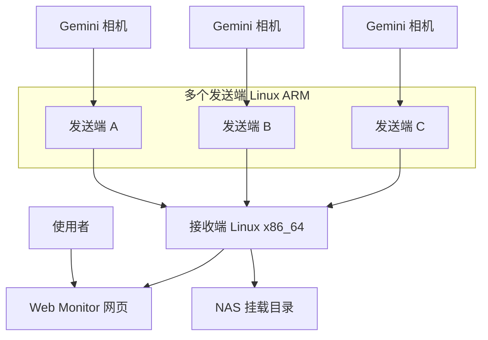

# 从零开始理解项目

更新时间：2026-09-02

这篇文档用尽量直白的方式说明项目是什么。读完后，你应该能知道系统为什么存在、有哪些设备、每个设备负责什么，以及一次录制大概会发生什么。

## 1. 一句话说明

`wireless_video_delivery` 是一个把多台 Orbbec Gemini RGBD 相机的数据，通过无线网络集中传到一台接收端，再由接收端网页预览和录制到 NAS 的工程。

这里的 RGBD 指两类数据：

1. RGB：普通彩色视频，给人看画面。
2. Depth：深度图，每个像素表示距离，给算法或后处理使用。

## 2. 它解决什么问题

如果每台相机都插在同一台电脑上，线缆会很复杂，设备位置也受限制。这个项目的思路是把相机分散接到多个小型 Linux 设备上，让这些设备作为发送端，通过 Wi-Fi 把数据发回接收端。

接收端统一做三件事：

1. 看状态和预览画面。
2. 控制开始或停止录制。
3. 把录制数据写到 NAS 目录，方便后续拷贝和处理。

## 3. 系统里有哪些角色



### 发送端

发送端通常是树莓派、香橙派、RK3588 这类 Linux ARM/ARM64 设备。

发送端负责：

1. 连接 Orbbec Gemini 相机。
2. 采集 RGB 和 Depth。
3. 把 RGB 压成 H.264 视频包。
4. 把 Depth 作为原始深度帧、zlib 无损帧或配置的量化/分块压缩帧发送。
5. 运行 CLOCK_SYNC 客户端，向接收端上报本机到接收端的时间偏移估计。
6. 上报自己的状态、帧率、码率和相机在线情况。
7. 可选显示本机预览。

核心 sender 不写 NAS，也不决定录制窗口。可选物理按键应用可以调用 receiver 的 sender 级 API，但录制状态仍由 receiver 管理。

### 接收端

接收端是 Linux x86_64 主机，当前基线是 Ubuntu。

接收端负责：

1. 接收所有发送端的媒体数据。
2. 接收所有发送端的状态心跳。
3. 汇总在线相机列表。
4. 提供本地管理 API。
5. 提供 Web Monitor。
6. 根据网页或 REST 命令控制录制。
7. 把录制文件写入 NAS 挂载目录。

### Web Monitor

Web Monitor 是网页界面，当前由 FastAPI 服务提供。

它负责：

1. 显示发送端和相机是否在线。
2. 显示 RGB 和 Depth 预览。
3. 开始或停止全部相机录制。
4. 开始或停止单路相机录制。
5. 设置相机显示名称和单路文件名前缀。

Web Monitor 不定义底层数据语义。它只是显示和调用接收端 API。

### NAS

NAS 是录制文件的最终存放位置。当前生产配置在 NAS 隐藏目录直接写分片，关闭 fragmented MP4、Depth、CSV 和元数据后原子发布到正式目录，避免本地 staging 搬运和 RGB 整文件重封装。NAS 不适合实时直写时仍可回退到本地 staging + uploader。NAS 可以通过 NFS、CIFS/SMB 或现场等价网络文件系统挂载。

## 4. 一次录制会发生什么

1. 发送端启动。
2. 发送端打开相机，开始采集 RGB 和 Depth。
3. 发送端持续把媒体数据发给接收端。
4. 接收端即使没有开始录制，也会接收数据并生成网页预览。
5. 你在网页上点开始录制。
6. 接收端为每路相机在 NAS 隐藏写入区创建录制目录。
7. RGB 写成 `rgb.mp4`。
8. Depth 写成 `depth.mkv`。
9. 帧索引、时间戳、`global_timestamp_us` 和诊断字段写进 `frames.csv`。
10. 相机参数写进 `calibration.json`。
11. 录制元信息写进 `meta.json`。
12. 你点停止录制后，接收端分离活动 writer，后台完成容器关闭与索引合并，实时预览继续运行。
13. 完整 fMP4 通过 NAS 同文件系统原子重命名发布，不执行普通 MP4 整文件重封装。
14. 正式目录最后出现 `recording_ready.json`，该段才可交给下游。

## 5. 最重要的身份概念

多发送端系统最容易出问题的是身份混乱。

系统使用两个 ID：

1. `sender_id`：一台发送端设备的稳定身份。
2. `camera_id`：这台发送端上某个物理相机或相机槽位的稳定身份。

接收端把它们组合成唯一 key：

```text
<sender_id>_<camera_id>
```

这个 key 同时影响：

1. Web 页面里的相机列表。
2. 单路录制控制。
3. 默认存储目录。
4. 下游数据同步。
5. 历史录制和当前在线相机的对应关系。

所以不要随意改 `sender_id` 或 `camera_id`。如果只是想让网页显示更好看，用相机自命名；如果只是想让文件名前面带业务名，用文件名前缀。

## 6. 当前已经实现

当前主线已经具备：

1. C++ 发送端。
2. C++ 接收端。
3. Orbbec Gemini RGB/Depth 采集路径。
4. RGB H.264 发送。
5. Depth 原始帧、zlib 无损和量化/分块压缩发送。
6. TCP 媒体通道、UDP 状态通道和 UDP CLOCK_SYNC 通道。
7. 接收端 Web Monitor。
8. 全局和单路录制控制。
9. NAS 目录落盘。
10. `frames.csv` 中的 RGB 视频帧索引、原始时间戳、系统时间戳和 `global_timestamp_us` 字段。
11. 发送端 watchdog、Wi-Fi guard、预检和状态脚本。
12. 接收端 systemd 用户服务和日志轮转脚本。

## 7. 当前不应该误解成已实现

下面内容可能出现在历史文档里，但不是当前主线默认能力：

1. Windows 接收端。
2. Python SDK 实时输出。
3. RTP/UDP 5600 旧链路。
4. SRT、WebRTC 等替代传输协议。
5. 硬件同步、PTP 或严格画面内容级同步。
6. 7x24 满负载稳定运行承诺。
7. Web 端历史录像检索系统。

## 8. 关键名词

| 名词 | 含义 |
| --- | --- |
| RGB | 彩色视频 |
| Depth | 深度图，每个像素表示距离 |
| RGBD | RGB + Depth |
| 发送端 | 连接相机并把数据发出去的小型 Linux 设备 |
| 接收端 | 接收所有数据、提供网页和写入 NAS 的 Linux 主机 |
| NAS | 网络存储，接收端通过挂载目录写入 |
| `sender_id` | 发送端稳定身份 |
| `camera_id` | 相机稳定身份 |
| `camera_key` | `<sender_id>_<camera_id>` |
| `frames.csv` | 每个媒体包和录制帧的索引、时间戳、诊断字段 |
| `meta.json` | 一段录制的整体元信息 |
| `calibration.json` | 相机内参、外参和 Depth 换算信息 |
| `global_timestamp_us` | 接收端用 CLOCK_SYNC offset 换算后的统一时间轴时间戳 |
| fragmented MP4 | 更适合异常收尾恢复的 MP4 封装方式 |

## 9. 继续读什么

想理解为什么这么设计，读 [architecture.md](architecture.md)。

想理解数据怎么走，读 [data-pipeline.md](data-pipeline.md)。

想直接运行，读 [deployment.md](deployment.md)。
