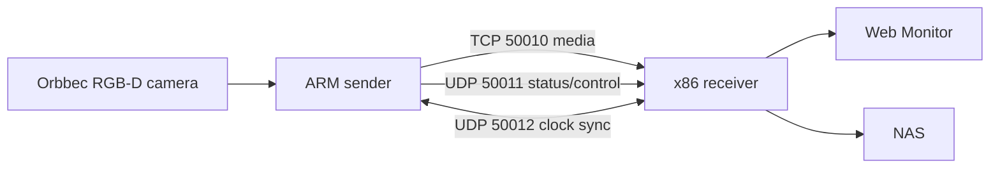

# wireless_video_delivery

`wireless_video_delivery` 是一套运行在 Linux 上的多机 Orbbec RGB-D 采集、传输、网页监控和 NAS 录制系统。仓库统一维护发送端、接收端、Web Monitor、设备配置、运维工具、可选语音/按键应用和自动测试。

## System At A Glance



当前正式链路：

1. sender 通过 Orbbec SDK 采集 RGB 和 Depth，并在采集处绑定帧时间。
2. RGB 编码为 H.264；Depth 保持 `uint16` 距离语义并按配置压缩。
3. receiver 接收媒体、派生预览、按统一录制窗口生成文件并发布到 NAS。
4. chrony 与 CLOCK_SYNC 建立跨 sender 的软件统一时间轴，`frames.csv` 保留 `global_timestamp_us`。
5. Web Monitor 只负责状态、预览和控制，不是正式数据源。

默认端口：

| Port | Protocol | Purpose |
| --- | --- | --- |
| 50010 | TCP | RGB/Depth 主媒体 |
| 50011 | UDP | 状态与控制 |
| 50012 | UDP | CLOCK_SYNC |
| 18080 | HTTP loopback | receiver admin API |
| 8080 | HTTP | Web Monitor 和局域网 REST API |

其他可选端口见 [API reference](04_docs/api-reference.md)。

## Start Here

| Reader | Recommended entry |
| --- | --- |
| 第一次接触项目 | [项目概览](04_docs/overview.md) |
| 负责现场部署 | [部署与运行](04_docs/deployment.md) |
| 调用 REST、视频流或读取文件 | [接口与数据格式](04_docs/api-reference.md) |
| 负责录制和 NAS | [录制与 NAS](04_docs/recording-and-nas.md) |
| 负责跨设备时间对齐 | [时间同步](04_docs/clock-sync.md) |
| 正在处理故障 | [故障排查](04_docs/troubleshooting.md) |
| 维护或发布代码 | [测试与发布](04_docs/testing-and-release.md) |

完整入口见 [文档索引](04_docs/index.md)。

## Quick Start

在接收端仓库根目录：

```bash
./05_tools/start_receiver.sh 06_configs/receiver_loop.json
./05_tools/status_receiver.sh 06_configs/receiver_loop.json
```

在已完成本机构建的发送端仓库根目录，根据设备选择配置：

```bash
./05_tools/sender_preflight.sh 06_configs/<sender-config>.json
./05_tools/start_sender.sh 06_configs/<sender-config>.json
./05_tools/status_sender.sh
```

停止服务：

```bash
./05_tools/stop_sender.sh
./05_tools/stop_receiver.sh 06_configs/receiver_loop.json
```

`start_receiver.sh` 会先构建 receiver；`start_sender.sh` 使用目标设备上已有的 `12_build/bin/gemini_sender`，缺少二进制时应先按部署文档在该设备本机构建。生产录制期间不要运行会重新构建、重启或停止当前服务的命令；先用 `status_*` 和只读 API 检查。完整依赖、自启动和回退流程见 [部署与运行](04_docs/deployment.md)。

## Repository Layout

| Directory | Responsibility |
| --- | --- |
| [01_sender_linux](01_sender_linux/README.md) | sender C++ 采集、编码、发送和恢复逻辑 |
| [02_receiver_linux](02_receiver_linux/README.md) | receiver C++ 接收、录制和发布逻辑 |
| [03_common_core](03_common_core/README.md) | sender/receiver 共用的线协议定义 |
| [04_docs](04_docs/index.md) | 当前主线长期维护文档 |
| [05_tools](05_tools/README.md) | 构建、部署、运维、诊断和数据工具 |
| [06_configs](06_configs/README.md) | receiver、sender、音频和系统配置 |
| [07_samples](07_samples/README.md) | 小型、脱敏、可提交的样例数据 |
| [08_reports](08_reports/README.md) | 被忽略的运行日志根目录 |
| [09_web_monitor](09_web_monitor/README.md) | FastAPI 网页和 REST 代理 |
| [10_tests](10_tests/README.md) | C++、Python 和集成测试 |
| [11_third_party](11_third_party/README.md) | 第三方依赖版本与放置规则 |
| [12_apps](12_apps/README.md) | 可选语音、拍照、按键和 LED 应用 |

## Non-Negotiable Rules

- `<sender_id>_<camera_id>` 是稳定且唯一的相机身份，不能用显示名称、当前 IP 或临时 USB 顺序替代。
- 正式数据只消费带 `recording_ready.json` 的 NAS 最终目录；活动隐藏目录和网页预览不能作为质量验收依据。
- 下游必须按 CSV 表头解析字段，并通过 `rgb_video_frame_index` 关联 RGB 解码帧。
- `global_timestamp_us` 是软件统一时间轴，不等于相机硬件同步；内容级对齐仍需离线验证和补偿。
- 不提交密码、访问令牌、Wi-Fi PSK、NAS 原始数据、本地 SDK 二进制、运行日志或备份包。
- 生产部署必须核对运行中的 commit、组件源码哈希和 dirty 状态，不能只核对仓库分支。

## Contribution Flow

1. 从 `main` 开始修改，保持变更范围聚焦。
2. 更新与行为对应的正式文档，不新增按日期命名的阶段总结。
3. 运行相关测试和配置验证。
4. 在目标架构本机编译；不要跨设备复制不兼容二进制。
5. 部署前记录当前版本，部署后核对状态与运行版本。

详细要求见 [测试与发布](04_docs/testing-and-release.md)。
