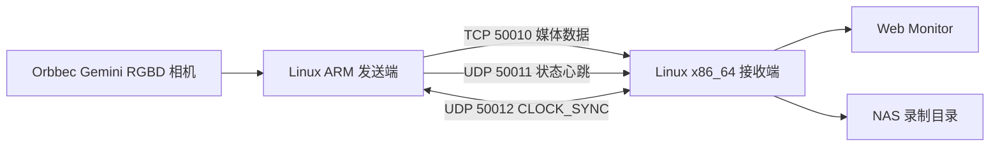

# wireless_video_delivery

`wireless_video_delivery` 是一套多路 Orbbec Gemini RGBD 相机的无线采集、传输、网页预览和录制工程。

这个仓库把发送端、接收端、Web Monitor、配置模板、运行脚本和文档放在一起，目标是在 Linux 设备上完成从相机采集到 NAS 落盘的完整链路。

## 先读什么

如果你是第一次看这个项目，按下面顺序读：

1. [04_docs/00_文档索引.md](04_docs/00_文档索引.md)
2. [04_docs/01_从零开始理解项目.md](04_docs/01_从零开始理解项目.md)
3. [04_docs/02_系统架构与技术路线.md](04_docs/02_系统架构与技术路线.md)
4. [04_docs/03_RGBD数据链路.md](04_docs/03_RGBD数据链路.md)
5. [04_docs/04_部署与运行手册.md](04_docs/04_部署与运行手册.md)

旧文档已经移动到 [04_docs/archive/README_历史文档说明.md](04_docs/archive/README_历史文档说明.md)。归档文档只用于追溯历史问题和取舍，不代表当前实现。

## 当前系统做什么

系统由发送端、接收端、Web Monitor 和 NAS 组成：



当前主线实现：

1. 发送端通过 Orbbec SDK 采集 RGB 和 Depth。
2. RGB 在发送端编码为 H.264 后发送。
3. Depth 以 `uint16` 深度帧为母版，支持原始帧、zlib 无损和量化/分块压缩模式。
4. CLOCK_SYNC 通过独立 UDP 端口估计 sender 到 receiver 的时间偏移，接收端生成 `global_timestamp_us`。
5. 接收端接收媒体数据和状态心跳，提供录制控制和网页预览。
6. 录制数据写入接收端挂载的 NAS 目录。
7. Web Monitor 用于看在线状态、实时预览、开始/停止录制和设置显示名称。
8. d12 语音服务可按需抓取相机原始 MJPEG；receiver 本地可靠确认后异步发布到 NAS `voice_photos`。

当前默认网络入口：

```text
media:   TCP 50010
status:  UDP 50011
clock:   UDP 50012
admin:   HTTP 127.0.0.1:18080
web:     HTTP 0.0.0.0:8080
```

## 当前不是目标

当前主线不把下面内容当成正式能力：

1. Windows 接收端。
2. Python SDK 实时取流接口。
3. RTP/UDP 5600 旧链路。
4. Web 端历史录像检索和下载系统。
5. 接收端远程修改发送端采集参数。
6. 硬件同步、PTP 或严格画面内容级同步。
7. 长时间 7x24 满负载稳定性承诺。

## 仓库目录

```text
01_sender_linux/     发送端 C++ 工程
02_receiver_linux/   接收端 C++ 工程
03_common_core/      发送端和接收端共用协议定义
04_docs/             当前主文档和历史归档
05_tools/            启动、停止、状态、导出和维护脚本
06_configs/          发送端和接收端配置模板
07_samples/          样例材料
08_reports/          近期运行、排查和合并归档；较早历史报告已迁入 04_docs/archive
09_web_monitor/      FastAPI Web Monitor
10_tests/            测试和模拟工具
11_third_party/      第三方依赖放置说明
12_apps/             独立应用实验；当前包含“小环”离线语音拍照服务
```

## 常用命令

接收端：

```bash
./05_tools/start_receiver.sh
./05_tools/status_receiver.sh
./05_tools/stop_receiver.sh
```

发送端：

```bash
./05_tools/start_sender.sh
./05_tools/start_sender_preview.sh
./05_tools/status_sender.sh
./05_tools/stop_sender.sh
```

具体部署、配置和排障步骤见 [04_docs/04_部署与运行手册.md](04_docs/04_部署与运行手册.md) 和 [04_docs/06_故障排查手册.md](04_docs/06_故障排查手册.md)。

## 关键约束

多发送端系统最重要的约束是身份稳定。

接收端使用 `<sender_id>_<camera_id>` 作为唯一相机 key。这个 key 影响网页预览、录制控制、存储目录、时间戳对齐和下游处理。不要为了临时调试、当前 IP、仓库默认配置或看起来更顺手而随意改 `sender_id` / `camera_id`。

文档和配置中不应提交密码、私有凭据、NAS 原始数据或本地临时备份。
