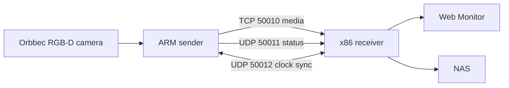

# wireless_video_delivery

`wireless_video_delivery` 是一套面向 Linux 的多机 Orbbec RGB-D 采集、无线传输、网页监控和 NAS 录制系统。仓库统一维护发送端、接收端、Web Monitor、设备配置、运维脚本、语音扩展与测试。

## Current Architecture



当前正式链路：

1. sender 通过 Orbbec SDK 采集 RGB 和 Depth。
2. RGB 编码为 H.264；Depth 保持 `uint16` 语义并按配置压缩。
3. receiver 接收媒体、生成预览、按统一时间窗录制并发布到 NAS。
4. chrony 与 CLOCK_SYNC 建立跨 sender 的统一时间轴，录制保留 `global_timestamp_us`。
5. Web Monitor 只负责状态、预览和控制，不是正式数据源。

当前默认端口：

| Port | Protocol | Purpose |
| --- | --- | --- |
| 50010 | TCP | RGB/Depth 主媒体 |
| 50011 | UDP | 状态与控制 |
| 50012 | UDP | CLOCK_SYNC |
| 18080 | HTTP loopback | receiver admin API |
| 8080 | HTTP | Web Monitor 和对外 REST |

## Documentation

从 [documentation index](04_docs/index.md) 开始。常用入口：

- [项目说明](04_docs/overview.md)
- [系统架构](04_docs/architecture.md)
- [数据链路](04_docs/data-pipeline.md)
- [部署手册](04_docs/deployment.md)
- [配置说明](04_docs/configuration.md)
- [接口参考](04_docs/api-reference.md)
- [录制与 NAS](04_docs/recording-and-nas.md)
- [故障排查](04_docs/troubleshooting.md)

历史阶段报告不再保存在主线工作区；可通过 Git 历史追溯。`08_reports/` 仅保留为运行日志目录，不能再提交现场日志或阶段报告。

## Repository Layout

```text
01_sender_linux/     sender C++ source
02_receiver_linux/   receiver C++ source
03_common_core/      shared wire protocol
04_docs/             maintained documentation
05_tools/            deployment, operations and analysis tools
06_configs/          device and service configurations
07_samples/          small non-sensitive samples
08_reports/          runtime log root, logs are ignored
09_web_monitor/      FastAPI monitor and REST proxy
10_tests/            automated and integration tests
11_third_party/      third-party dependency placement
12_apps/             optional device applications
```

## Common Commands

Receiver:

```bash
./05_tools/start_receiver.sh
./05_tools/status_receiver.sh
./05_tools/stop_receiver.sh
```

Sender:

```bash
./05_tools/start_sender.sh
./05_tools/start_sender_preview.sh
./05_tools/status_sender.sh
./05_tools/stop_sender.sh
```

Build and test details are in [testing-and-release.md](04_docs/testing-and-release.md).

## Invariants

- `<sender_id>_<camera_id>` 是稳定且唯一的相机身份，不能用显示名称、当前 IP 或临时 USB 顺序替代。
- 正式数据以带 `recording_ready.json` 的 NAS 目录为准；网页预览不能作为质量验收依据。
- 不提交密码、访问令牌、NAS 原始数据、本地 SDK 二进制、运行日志或备份包。
- 生产部署必须上报并核对 commit、组件源码哈希和 dirty 状态。
